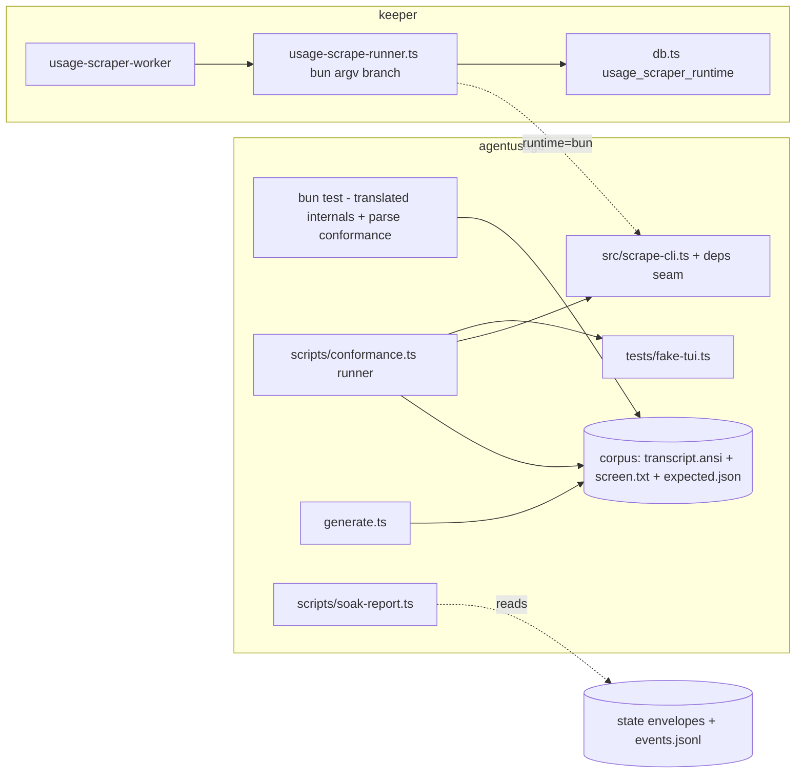

## Overview

First half of the cutover that finishes the agentusage Python→Bun port: translate the remaining Python-only internals tests to bun:test against the landed src/ shapes, move conformance custody onto artifacts that survive Python deletion (frozen rendered screens, a bun conformance runner, a bun corpus regenerator, a bun fake TUI), and land keeper's `uv|bun` usage-scraper runtime toggle with soak tooling. The epic ends with the toggle landed and everything in place to flip; the actual flip + sleep/wake soak is an operator phase after this epic lands, and a clean soak verdict gates a follow-up epic (uv-seam retirement + Python deletion — Python stays alive as the rollback throughout this epic).

## Quick commands

- `bun test` — bun:test suite incl. translated internals + in-process parse conformance over frozen screens (tmux-free, #24690-safe)
- `AGENTUSAGE_REQUIRE_CONFORMANCE=1 bun run conformance` — end-to-end bun CLI vs golden corpus through the fake TUI (needs tmux; skips demoted to failures)
- `AGENTUSAGE_REQUIRE_PARITY=1 uv run pytest tests/test_bun_parity.py tests/test_dual_run_cli.py` — the python-vs-bun parity gate, still authoritative and green through this epic
- `cd ~/code/keeper && bun test test/usage-scrape-runner.test.ts` — toggle + argv builder coverage
- `bun scripts/soak-report.ts` — soak evidence report over ~/.local/state/agentusage envelopes + events.jsonl

## Acceptance

- [ ] Every surviving behavior in tests/test_scrape_helpers.py and tests/test_scrape_cli.py has a bun:test translation (or an explicit dead-at-translation disposition recorded in the test file header comments), and `bun test` is green
- [ ] The parity gate (python vs bun) stays green on this box throughout — no existing pytest module weakened
- [ ] Conformance custody artifacts exist and are green: frozen per-case screen.txt with recorded provenance, in-process parse conformance in bun test, `bun run conformance` end-to-end runner with skip→fail promotion, generate.ts regenerating expected.json from frozen screens byte-identically
- [ ] The dual-run harness passes with the bun fake TUI (fake-tui.ts) spawned by BOTH CLIs — the python fake TUI has no remaining consumer
- [ ] Keeper resolves `usage_scraper_runtime` (env over config, invalid values fail closed to uv, default uv) per scrape; runtime=bun builds argv against the agentusage bun entry with an absolute bun binary; the daemon boot gate needs no edit; keeper fast tests cover the resolver and both argv branches
- [ ] Soak runbook + soak-report script exist; the report runs against current envelopes and renders per-profile success/arm/latency/orphan-server evidence vs a uv baseline window
- [ ] Nothing flips by default: the shipped config default remains uv everywhere

## Early proof point

Task that proves the approach: task 1 (deps-seam refactor + first translated arm tests). If the seam refactor fights the landed CLI shape: fall back to bun:test module mocks confined to a preload file for the arm tests only — the rest of the epic is unaffected.

## References

- Landed Epic A surface: src/scrape.ts, src/scrape-cli.ts, src/parse-bridge.ts, docs/adr/0001-tmux-scrape-driver.md, tests/fixtures/corpus/, tests/conftest.py
- Keeper seam: ~/code/keeper/src/usage-scrape-runner.ts (buildScrapeArgs :214, parseScrapeStdout :249 with its Bun#24690 empty_stdout guard, spawnScrape :381, runScrape :453), ~/code/keeper/src/db.ts (resolveUsageScraperRuntime :535, firstNonEmpty :483, key parsing :367-380), boot gate ~/code/keeper/src/daemon.ts:6032
- `fn-1131` (overlap) — open keeper epic bumps SCHEMA_VERSION in the same src/db.ts this epic edits; dep-wired to serialize the merge
- Bun#24690 (OPEN, verified) — subprocess stdout via pipe is empty inside bun test; temp-file capture or standalone runners are the workarounds. mock.module leaks globally — deps-seam injection preferred
- No live double-execution against the rate-limited /usage panel: soak comparison is bun-vs-golden offline; the flip is either/or per profile

## Docs gaps

- **tests/corpus_schema.md**: update regen instructions for generate.ts + frozen screen.txt layer and record the python-generator provenance (full bun-canonical rewording happens at deletion time)
- **README.md / CLAUDE.md**: no changes this epic — dual-runtime wording stays true until the deletion epic

## Best practices

- **Temp-file capture for subprocess stdout anywhere near bun test:** Bun#24690 returns empty pipes inside bun test; the conformance runner is a standalone `bun run` script and captures via files [tracker + community workaround]
- **Seam injection over mock.module:** bun's module mocks are process-global, leak across files, and restore unreliably — the run() deps seam is the house pattern [Bun issues + keeper conventions]
- **Absolute binary paths under launchd:** stripped env; bun defaults to the daemon's own process.execPath, tmux's dir must ride the injected PATH [Apple guidance]
- **tmux server is ephemeral across sleep/wake:** create-if-absent per scrape already handles it; the soak checks for orphaned servers/sockets rather than assuming persistence [maintainer threads]
- **Freeze goldens before the generator dies:** corpus becomes the normative contract; provenance (python commit + invocation) recorded so fixtures stay reconstructible [conformance-program practice]

## Alternatives

- **Port everything including deletion in one epic** — rejected: the soak needs wall-clock days across a sleep/wake through launchd; no task acceptance can verify it from a lane, so deletion is planned after the soak verdict instead
- **Shadow-run both runtimes live for comparison** — rejected: double-consumes the rate-limited /usage panel and can trip cooldowns; comparison is offline bun-vs-golden
- **mock.module for the CLI arm tests** — rejected: global leakage; a deps parameter on run() is smaller and matches keeper style
- **Keep fake_tui.py as a python3 test dependency** — rejected: contradicts the bun-only end state; ported to fake-tui.ts while the python CLI can still validate it via the existing dual-run parity

## Architecture

## Rollout

This epic ships dark: the keeper default stays uv, so nothing changes in production when it lands. The operator phase after landing flips `usage_scraper_runtime` to bun as an override (default untouched — rollback is clearing one value), soaks across at least one real sleep/wake through the LaunchAgent with StandardOutPath redirection only for the soak window, and evaluates with soak-report against the uv baseline. Clean soak → a follow-up epic retires the uv seam and deletes Python (retirement strictly after deletion commits). Failed soak → clear the override, keeper resumes uv, and the bun leg is debugged with zero production impact.
