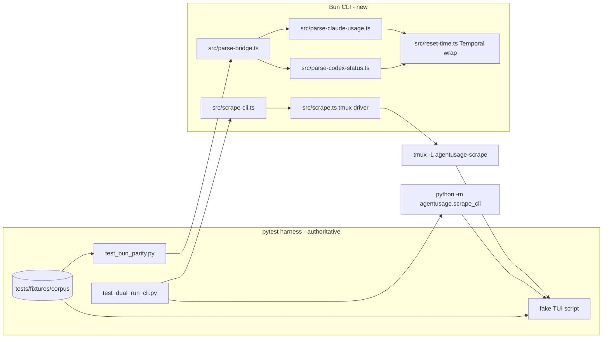

## Overview

Replace the Python scrape core (`scrape.py`, `parse_claude_usage.py`, `parse_codex_status.py`, `agentusage/scrape_cli.py`) with a native Bun/TypeScript CLI that speaks the identical schema_version-1 stdout contract keeper's `usage-scrape-runner.ts` parses. The PTY layer is a tmux driver on a dedicated named server (`tmux -L agentusage-scrape`); parsers port 1:1 with `@js-temporal/polyfill` timezone math. Parity is proven inside the still-authoritative pytest suite: a parse-bridge parity module over the existing fixture corpus plus a dual-run end-to-end module driving BOTH CLIs against a scripted fake TUI. The Python implementation stays green and authoritative throughout; the keeper flip, bun:test translation, and Python deletion are a follow-up epic planned after this one lands.

## Quick commands

- `uv run pytest` — authoritative suite, must stay green (parity modules skip when bun/tmux absent)
- `AGENTUSAGE_REQUIRE_PARITY=1 uv run pytest tests/test_bun_parity.py tests/test_dual_run_cli.py` — parity gate with skips promoted to failures (the epic's acceptance run)
- `bun run lint && bun run typecheck` — Biome + tsc over the new TS surface
- `printf '%s' "$(cat tests/fixtures/corpus/claude-subscribed.txt)" | bun src/parse-bridge.ts --target claude --now 2026-05-29T12:00:00-04:00` — bridge smoke
- `uv run pytest -m live` — opt-in real-TUI recorder + live parity (excluded by default)

## Acceptance

- [ ] `uv run pytest` green with the parity modules active on this box (bun + tmux present), and green-with-skips on hosts lacking them
- [ ] `AGENTUSAGE_REQUIRE_PARITY=1` run passes: parse-bridge parity over every corpus case AND dual-run CLI parity (semantic JSON deep-equality, exact ISO strings, exactly one stdout line with trailing newline, matching exit codes) across all four arms for claude and codex
- [ ] The Bun CLI accepts the same argv surface as the Python CLI (`--target`, `--profile`, `--command`, `--rows`, `--cols`) and emits only the four contract arms with correct exit codes (0/0/0/1)
- [ ] Existing test files (`test_parse_claude_usage.py`, `test_parse_codex_status.py`, `test_scrape_helpers.py`, `test_scrape_cli.py`) are byte-identical to their pre-epic state except for zero-behavior-change import additions if any prove unavoidable (default: untouched)
- [ ] `docs/adr/0001` records the tmux-driver decision (or the exercised fallback) with the spike evidence
- [ ] Biome check and `tsc --noEmit` clean; `package.json` carries a one-line verb-phrase description
- [ ] No scrape writes outside its tmux session, tmp sandbox, and the two trust files; recorded fixtures contain no unscrubbed secrets

## Early proof point

Task that proves the approach: task 4 (tmux capture-fidelity spike). If it fails: fall back — pre-approved, no check-in — to `bun-pty` + `@xterm/headless` behind the same `scrape.ts` module boundary; the driver task consumes the fallback stack and the ADR records the exercised path.

## References

- Wire contract consumer: `~/code/keeper/src/usage-scrape-runner.ts:249-353` (`parseScrapeStdout`, schema_version 1, signed_out checked before no_subscription before usage; 60s SIGKILL budget at :43)
- Producer/envelope already in keeper: `~/code/keeper/src/usage-scraper-worker.ts` (deriveLiftAt :456-481; its `localIsoWithOffset` emits millis — do NOT reuse for `resets_at`)
- House style precedent: `~/code/keeper/src/usage-picker.ts`, `~/code/keeper/src/usage-flock.ts`, `~/code/keeper/tsconfig.json`, `~/code/keeper/biome.json`
- Port surface: `scrape.py` (TARGETS :51-122, state machine :391-573, pumps :315-385, cleanup :574-598), `parse_claude_usage.py`, `parse_codex_status.py`, `agentusage/scrape_cli.py`
- Bun issues shaping decisions: #25822/#29112 (node-pty broken under Bun), #25912 (Bun.Terminal PTY allocation fails after macOS sleep/wake — disqualifying under LaunchAgent), #33237 (no controlling terminal), #24690 (empty subprocess stdout inside `bun test` — parity harness therefore lives in pytest), #28145 (`bun build --compile` truncates stdout at 8KB — do not ship `--compile`)

## Docs gaps

- **README.md**: revise "no longer ships any TypeScript / Python-only" claims to the dual-runtime truth; extend Development for bun + parity commands; add the missing `signed_out` row to the discriminated-arms table (pre-existing omission)
- **CLAUDE.md** (AGENTS.md is a symlink — edit in place): "Python-only repo" and "pyproject.toml is the sole authoritative manifest" invariants become dual-runtime statements; one-line pointer to the ADR, no architecture prose
- **package.json** (new): one-line verb-phrase `description` per the shared manifest convention

## Best practices

- **capture-pane `-pJ`, never `-a`:** plain `-p` captures the visible screen (the TUI when alt-screen is active); `-a` errors when the pane is not on the alternate screen [tmux man page]
- **send-keys `-l` is literal-only:** the slash text goes via `send-keys -l`; `C-u` and `Enter` are separate non-literal `send-keys` calls [tmux man page]
- **Per-session options only:** `escape-time 0`, `status off` set per-session after `new-session` — a `-g` write disturbs concurrent scrapes on the shared server
- **Bun.spawn discipline:** drain stdout and stderr concurrently (backpressure deadlock otherwise); `killSignal: "SIGKILL"` on timeouts [Bun docs]
- **Temporal:** `toString({smallestUnit:'second'})` strips fractional seconds; unknown IANA zone throws `RangeError` natively; set `disambiguation` explicitly ('compatible' matches Python fold=0 for these shapes) [TC39/MDN]
- **Corpus:** canonical implementation is Python; version the corpus as the contract; compare normalized transcripts; scrub secrets length-preservingly BEFORE persistence; never assert intermediate frames [ground-truth-corpus pattern]

## Alternatives

- **bun-pty + @xterm/headless** — the pre-approved fallback (closer 1:1 pexpect/pyte port, owns setsid/TIOCSCTTY so immune to Bun PTY bugs); not primary because tmux adds zero new dependencies and outsources PTY+VT100+reaping to mature C code
- **Native Bun.Terminal** — deferred, not rejected: works on happy path on this host (Bun 1.3.14) but open #25912 (sleep/wake PTY allocation failure) is disqualifying under a LaunchAgent; re-evaluate when #25912/#33237 close
- **node-pty under Bun** — rejected: onData never fires (#25822/#29112)
- **Port directly into keeper now** — rejected: the conformance strategy needs the Python suite here as the authority; the move happens after cutover

## Architecture

## Rollout

Epic A is purely additive: keeper keeps invoking the Python CLI via uv throughout; nothing consumes the Bun CLI yet, so rollback inside this epic is a no-op. The follow-up epic adds keeper's `runtime: uv|bun` toggle, flips after a sleep/wake-crossing staggered soak inside the 60s budget, retires the uv config keys last, and deletes Python last — the toggle is the one-flip rollback lever until then.
